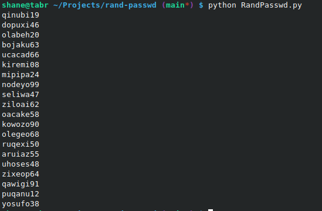

# rand-passwd

Just a random password generator, saving for posterity.  If it's useful to someone, great!  More than likely you already have a better utility, though.  The hope is that these passwords will be both random, and relatively easy to memorize.
